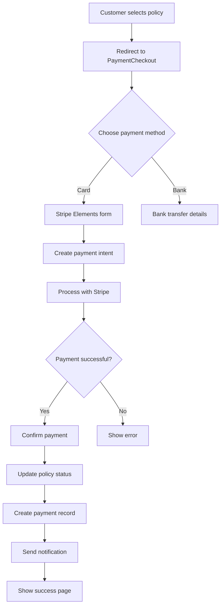

# 🚀 Stripe Payment Integration - Implementation Guide

## ✅ **What's Been Implemented**

### **Backend (Django)**
- ✅ **Stripe Configuration** - Added to `settings.py`
- ✅ **Payment Intent Creation** - `create_payment_intent` view
- ✅ **Payment Confirmation** - `confirm_payment` view  
- ✅ **Webhook Handler** - `stripe_webhook` for automatic processing
- ✅ **URL Configuration** - Added payment endpoints
- ✅ **Error Handling** - Comprehensive error management
- ✅ **Security** - User authentication and authorization

### **Frontend (React)**
- ✅ **Stripe Context Provider** - Global Stripe configuration
- ✅ **Payment Form Component** - Secure card input
- ✅ **Payment Checkout Page** - Dual payment methods
- ✅ **API Integration** - Payment functions in `lib/api.ts`
- ✅ **Success/Failure Handling** - User feedback and navigation

## 🛠️ **Setup Instructions**

### **1. Install Dependencies**

**Backend:**
```bash
cd backend
pip install stripe
```

**Frontend:**
```bash
npm install @stripe/stripe-js @stripe/react-stripe-js
```

### **2. Environment Variables**

**Frontend (.env.local):**
```bash
VITE_STRIPE_PUBLISHABLE_KEY=pk_test_51S56nlC4JPnk6JAKZDUUh8Hxx22eZKZJef90LQtSRBYlj0OYHYSfgsxxF7LieM0fcozghPw12N7LlnyjmEtMw4nv005l17hvwr
VITE_API_BASE=https://localhost:8000
```

**Backend (.env):**
```bash
STRIPE_PUBLISHABLE_KEY=pk_test_51S56nlC4JPnk6JAKZDUUh8Hxx22eZKZJef90LQtSRBYlj0OYHYSfgsxxF7LieM0fcozghPw12N7LlnyjmEtMw4nv005l17hvwr
STRIPE_SECRET_KEY=sk_test_51S56nlC4JPnk6JAKPazekul0IQw20SjRpMurgAEWSMkldm4t3st9C5lkxunjQ3YUtvz6UQ4d8Xw56xbfSm1ztL1200dcBnlfwC
STRIPE_WEBHOOK_SECRET=whsec_your_webhook_secret_here
```

### **3. Start the Application**

**Backend:**
```bash
cd backend
python manage.py runserver 0.0.0.0:8000
```

**Frontend:**
```bash
npm run dev
```

## 🧪 **Testing the Integration**

### **Test Cards (Stripe Test Mode)**
- **Success**: `4242424242424242`
- **Decline**: `4000000000000002`
- **Requires Authentication**: `4000002500003155`
- **Insufficient Funds**: `4000000000009995`

### **Test Flow**
1. **Create a policy** through the application
2. **Navigate to payment** - `/payments/checkout?policy={policy_id}`
3. **Select "Card Payment"** tab
4. **Enter test card details**
5. **Click "Pay"** button
6. **Verify success** - Policy should be activated

## 🔗 **API Endpoints**

### **Payment Intent Creation**
```
POST /api/payments/create-payment-intent/
Content-Type: application/json
Authorization: Bearer {token}

{
  "amount": 5000,  // Amount in cents
  "policy_id": "123",
  "currency": "usd"
}
```

### **Payment Confirmation**
```
POST /api/payments/confirm/
Content-Type: application/json
Authorization: Bearer {token}

{
  "payment_intent_id": "pi_xxx",
  "policy_id": "123"
}
```

### **Stripe Webhook**
```
POST /api/stripe/webhook/
Content-Type: application/json
Stripe-Signature: {signature}

{webhook payload}
```

## 🎯 **Payment Flow**



## 🔒 **Security Features**

- **PCI Compliance** - Card data never touches your servers
- **Webhook Verification** - Stripe signature validation
- **User Authentication** - JWT token required
- **Authorization** - Users can only pay for their own policies
- **Duplicate Prevention** - Payment records checked for duplicates

## 🚀 **Production Deployment**

### **1. Update Stripe Keys**
Replace test keys with live keys in production:
- `pk_live_...` for publishable key
- `sk_live_...` for secret key

### **2. Configure Webhooks**
In Stripe Dashboard:
- **URL**: `https://yourdomain.com/api/stripe/webhook/`
- **Events**: `payment_intent.succeeded`, `payment_intent.payment_failed`

### **3. Update CORS Settings**
Add your production domain to `CORS_ALLOWED_ORIGINS` in `settings.py`

## 🐛 **Troubleshooting**

### **Common Issues**

1. **"Stripe not loaded"** - Check publishable key
2. **"Payment failed"** - Verify secret key and webhook secret
3. **"CORS error"** - Update CORS settings
4. **"Policy not found"** - Check policy ID and user permissions

### **Debug Mode**
Enable debug logging in Django:
```python
LOGGING = {
    'version': 1,
    'disable_existing_loggers': False,
    'handlers': {
        'console': {
            'class': 'logging.StreamHandler',
        },
    },
    'loggers': {
        'django': {
            'handlers': ['console'],
            'level': 'DEBUG',
        },
    },
}
```

## 📊 **Monitoring**

### **Stripe Dashboard**
- Monitor payments in real-time
- View failed payments
- Check webhook delivery status

### **Application Logs**
- Payment creation logs
- Webhook processing logs
- Error tracking

## 🎉 **Success!**

Your Stripe payment integration is now complete and ready for testing. The system supports:

- ✅ **Secure card payments** via Stripe
- ✅ **Bank transfers** for local customers
- ✅ **Automatic policy activation**
- ✅ **Payment notifications**
- ✅ **Comprehensive error handling**
- ✅ **Production-ready security**

Happy coding! 🚀


